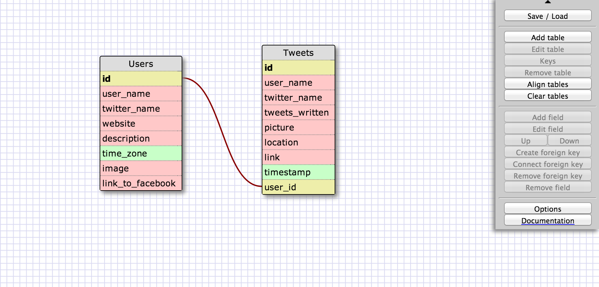

# U3.W7: Modeling a Real-World Database (SOLO CHALLENGE)

## Release 0: Users Fields
USERS

id
user_name
twitter_name
website
description
time_zone
image
link_to_facebook

<!-- Identify the fields Twitter collects data for -->

## Release 1: Tweet Fields
TWEETS

id
user_name
twitter_name
tweets_written (character restricted)
picture
location
link
timestamp
user_id

<!-- Identify the fields Twitter uses to represent/display a tweet. What are you required or allowed to enter? -->

## Release 2: Explain the relationship
The relationship between `users` and `tweets` is: 
One to many because each tweet belongs to one user, and a user can have many tweets. A "retweet" is a duplication, but is still a unique tweet (probably?)
<!-- because... -->

## Release 3: Schema Design

## Release 4: SQL Statements

all the tweets for a certain user id
SELECT tweets FROM user_name = certain user id.

the tweets for a certain user id that were made after last Wednesday (whenever last Wednesday was for you)

SELECT tweets FROM WHERE user_name = certain user id AND timestamp is after last wednesday

all the tweets associated with a given user's twitter handle
SELECT tweets FROM WHERE twitter_name = given twitter handle

the twitter handle associated with a given tweet id
SELECT twitter_name FROM tweets WHERE user_ID = some value
<!-- Include your SQL Statements. How can you make markdown files show blocks of code? -->

## Release 5: Reflection
Interesting to practice ways to call specific data from databases.